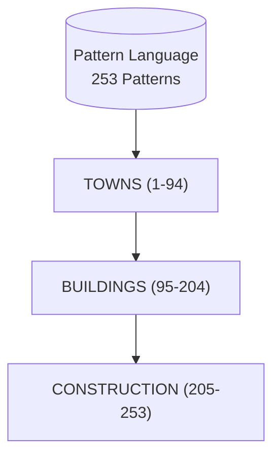
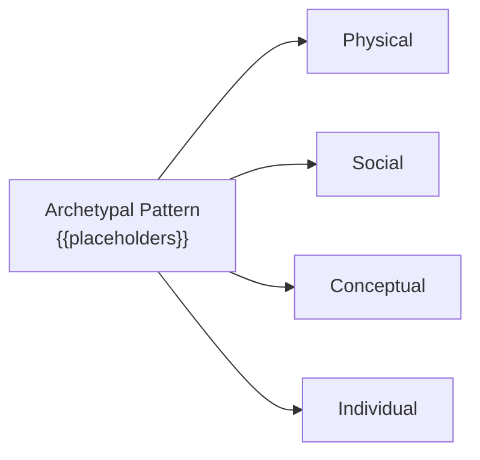

# CLAUDE.md

## Project Overview

**p235/cog253** - A repository containing collections of design patterns and organizational metaphors with formal specifications, including Christopher Alexander's "A Pattern Language" (APL) and UIA organizational patterns.

## Quick Reference

### Run Tests
```bash
python3 test_archetypal_schema.py      # Test archetypal pattern schema
python3 test_opencog_atomese.py        # Test OpenCog Atomese base files
python3 test_enhanced_atomese.py       # Test enhanced Atomese features
python3 validate_schema.py             # Validate APL schema
python3 validate_archetypal_patterns.py # Validate archetypal patterns
./verify_implementation.sh             # Full implementation verification
./verify_schemas.sh                    # Verify all schemas
```

### Generate Schemas
```bash
python3 generate_pattern_schema.py      # Generate APL Pattern Language schema
python3 generate_archetypal_schema.py   # Generate Archetypal Pattern schema
python3 generate_opencog_atomese.py     # Generate base Atomese files
python3 generate_enhanced_atomese.py    # Generate enhanced Atomese features
```

### Demo Scripts
```bash
python3 demo_pattern_schema.py          # Demo APL schema
python3 demo_archetypal_schema.py       # Demo Archetypal schema
python3 demo_enhanced_atomese.py        # Demo enhanced Atomese features
```

## Architecture

### Pattern Collections
- **APL (A Pattern Language)**: 253 architectural and urban design patterns from Christopher Alexander
- **UIA (Union of International Associations)**: 253 organizational and conceptual patterns
- **Archetypal Patterns**: 102 abstract patterns with domain-specific placeholders

### Archetypal Pattern Format
Patterns use the format: `"generic {{domain-specific-placeholder}} generic"`

Domain transformations:
- **Physical** - Spatial, material, architectural domains
- **Social** - Organizational, community, institutional domains
- **Conceptual** - Knowledge, theoretical, paradigmatic domains
- **Individual** - Awareness, consciousness, mental domains

### Key Data Files
| File | Purpose |
|------|---------|
| `archetypal_patterns.json` | All 102+ archetypal patterns with domain mappings |
| `archetypal_pattern_schema.json` | JSON schema for archetypal patterns |
| `archetypal_placeholders.json` | Placeholder reference documentation |
| `pattern_language_generated.json` | Complete APL meta-pattern and sequences |
| `pattern_sequences.json` | All 36 pattern sequences |
| `category_*.json` | Towns, Buildings, Construction categories |

## Directory Structure

```
/apl/                    # Original APL HTML files (253 patterns)
/uia/                    # Original UIA pattern files (253 patterns)
/pattern/                # Individual pattern files
/markdown/               # Converted markdown versions
  /apl/                  # APL patterns (apl001.md - apl253.md)
  /uia/                  # UIA patterns
  /arc/                  # 102 Archetypal patterns with placeholders
/opencog_atomese/        # OpenCog Atomese Scheme representations
  /patterns/             # Individual .scm files
/docs/                   # Technical documentation (Z++ specs, diagrams)
/diagrams/               # Mermaid (.mmd) visualization diagrams
/implementations/        # Pattern implementations (AIML, PyTorch, Mermaid)
```

## Diagrams

The `/diagrams/` directory contains Mermaid diagrams for visualizing the pattern language:

### Pattern Language Hierarchy


### Domain Transformations


### Available Diagrams

| Diagram | Description |
|---------|-------------|
| `generalized-pattern.mmd` | Anatomy of a single pattern (Context → Problem → Solution → Connections) |
| `pattern-aiml-implementation.mmd` | AIML rule-based implementation of pattern matching |
| `pattern-pytorch-implementation.mmd` | PyTorch neural network with tensor embeddings |
| `pattern-language-hierarchy.mmd` | Three categories: Towns, Buildings, Construction |
| `pattern-sequences.mmd` | 36 sequences from regional planning to completion |
| `domain-transformations.mmd` | Physical, Social, Conceptual, Individual domains |
| `architecture-layers.mmd` | System architecture (Presentation → Foundation) |
| `pattern-relationships.mmd` | Hierarchy, sequence, dependency, emergence links |
| `placeholder-system.mmd` | 10 core placeholders and domain mappings |
| `data-flow.mmd` | Source → Generator → Output pipeline |
| `cognitive-affordances.mmd` | Mind map of "optimal grip" concepts |

### Viewing Diagrams

```bash
# View in Mermaid Live Editor
cat diagrams/pattern-sequences.mmd
# Paste output at: https://mermaid.live/

# Generate SVG (requires mermaid-cli)
npx @mermaid-js/mermaid-cli mmdc -i diagrams/pattern-sequences.mmd -o pattern-sequences.svg
```

## Implementations

The `/implementations/` directory contains executable pattern implementations:

### Patterns 1-7: Regional Policies

| File | Format | Description |
|------|--------|-------------|
| `patterns-001-007.mmd` | Mermaid | Visual diagram of patterns and relationships |
| `patterns-001-007.aiml` | AIML 2.0 | Rule-based chatbot for pattern navigation |
| `patterns_001_007_nn.py` | PyTorch | Neural network with embeddings and GNN |

### Running Implementations

```bash
# Run PyTorch neural network demo
python3 implementations/patterns_001_007_nn.py

# View Mermaid diagram
cat implementations/patterns-001-007.mmd
```

### AIML Structure
```xml
<category>
  <pattern>INDEPENDENT REGIONS</pattern>
  <template>
    Pattern 1: Work toward independent regions
    with 2-10 million people each...
    <srai>LIST FOLLOWING PATTERNS 1</srai>
  </template>
</category>
```

### PyTorch Model Architecture
```
PatternLanguageModel
├── PatternEncoder (text + embeddings)
│   ├── PatternEmbedding(253, 128)
│   ├── ConfidenceEmbedding(3, 32)
│   ├── ProblemEncoder (BiLSTM)
│   └── SolutionEncoder (BiLSTM)
├── PatternGNN (graph convolution)
└── Output Heads
    ├── NextPatternHead → predict following patterns
    ├── CategoryHead → classify Towns/Buildings/Construction
    └── SimilarityHead → compute pattern similarity
```

## Tech Stack
- **Python 3** - Schema generation, validation, testing
- **JSON** - Data storage and schema definitions
- **Scheme** - OpenCog Atomese knowledge representation
- **Markdown** - Documentation and pattern text
- **Mermaid** - Diagram visualization (.mmd files)
- **AIML** - Rule-based pattern matching chatbot
- **PyTorch** - Neural network pattern embeddings

## Code Conventions

### Python Scripts
- Use `#!/usr/bin/env python3` shebang
- Use type hints for function parameters and returns
- JSON files use 2-space indentation
- Regex patterns for parsing markdown content

### Pattern IDs
- APL patterns: `apl1` through `apl253`
- UIA patterns: Numeric IDs like `12610010`
- Archetypal patterns: Same IDs as source UIA patterns

### Placeholder Syntax
- Format: `{{placeholder-name}}`
- Example: `{{domains}}`, `{{frameworks}}`, `{{elements}}`
- 10 core placeholders defined in `archetypal_placeholders.json`

## Common Tasks

### Adding New Patterns
1. Add markdown file to appropriate `markdown/` subdirectory
2. Run `python3 generate_archetypal_schema.py` to regenerate schemas
3. Run `python3 test_archetypal_schema.py` to validate
4. Update documentation if needed

### Validating Changes
```bash
python3 validate_archetypal_patterns.py
python3 test_archetypal_schema.py
./verify_schemas.sh
```

### Working with OpenCog Atomese
- Main file: `opencog_atomese/pattern_language.scm`
- Enhanced features: `opencog_atomese/pattern_language_enhanced.scm`
- See `OPENCOG_ATOMESE_README.md` for query examples
